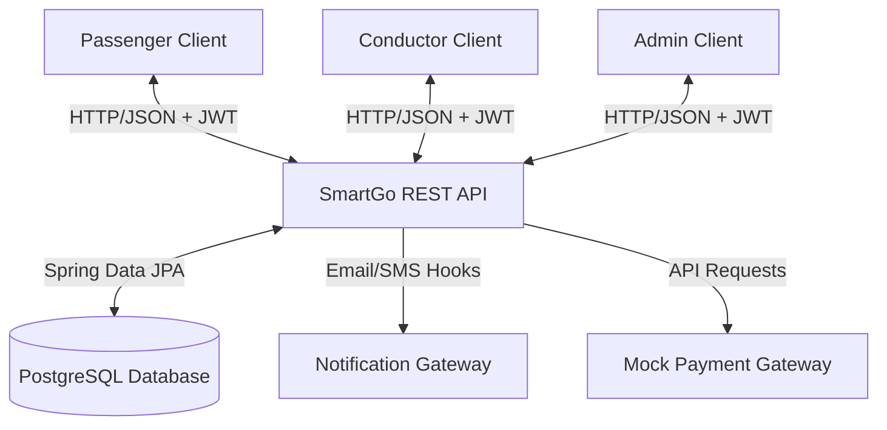

# Software Requirements Specification (SRS)

## 1. Introduction

### 1.1 Purpose
This document specifies the software requirements for the **SmartGo** Smart Bus Reservation & Management System. It outlines both functional and non-functional requirements to serve as a baseline for the design, implementation, and verification of the system's backend and frontend components.

### 1.2 Document Conventions
*   **RBAC**: Role-Based Access Control
*   **JWT**: JSON Web Token
*   **SRS**: Software Requirements Specification
*   **REST**: Representational State Transfer
*   **MFA**: Multi-Factor Authentication
*   **JSON**: JavaScript Object Notation

---

## 2. System Overview & Scope

### 2.1 Scope
SmartGo is an enterprise-grade web-based platform that replaces traditional paper-based bus ticketing and manual transit coordination. The scope encompasses:
1.  **Passenger Portal**: A responsive web application enabling search, seat selection, booking, secure mock checkout, profile management, and ticket downloads.
2.  **Conductor Mobile Portal**: A mobile-optimized web interface enabling conductors to check trip manifests and scan passenger QR tickets for boarding verification.
3.  **Admin Dashboard**: A secure web portal for system administrators to configure routes, manage the bus fleet, coordinate schedules, view system health, and generate financial reports.

### 2.2 System Context Diagram (Conceptual)

---

## 3. Stakeholders

1.  **Passengers**: Standard users searching for trips, booking seats, processing payments, and downloading QR-enabled boarding passes.
2.  **Transit Conductors**: Staff responsible for passenger boarding, manifest verification, and ticket QR code validation.
3.  **System Administrators (Admins)**: Core IT or transit operations managers who control fleet details, user privileges, schedules, pricing, and system parameters.
4.  **Transit Operators / Owners**: Stakeholders monitoring revenue, load factors, and schedule efficiency.
5.  **External Providers**: Gateway integrations for card processing (e.g., Stripe, PayPal API mockups) and messaging/SMS delivery services.

---

## 4. Functional Requirements

### 4.1 Authentication & User Management (Auth & User Modules)
*   **FR-AUTH-01 (Register)**: The system must allow new passengers to sign up using an email address, password, full name, and phone number.
*   **FR-AUTH-02 (Login)**: The system must authenticate passengers, conductors, and administrators using email and password, returning a stateless JWT upon success.
*   **FR-AUTH-03 (Token Expiry)**: JWTs must have a defined expiration limit (e.g., 2 hours for passengers, 8 hours for conductors/admins).
*   **FR-AUTH-04 (Role Assignment)**: Standard registration defaults to the `Passenger` role. Only an Administrator can assign or modify roles (`Admin`, `Conductor`).
*   **FR-USER-05 (Profile Edit)**: Authenticated users must be able to view and edit their profile details (excluding email address) and update passwords.

### 4.2 Bus & Seat Management (Bus & Seat Modules)
*   **FR-BUS-01 (Bus Catalog)**: The system must store bus information including registration number, vehicle model, capacity, status (Active, Maintenance, Inactive), and Bus Type (AC, Non-AC, Sleeper, Seater).
*   **FR-BUS-02 (Seat Layout)**: The system must support dynamic seat layouts based on bus type (e.g., 2x2 layout, 1x2 layout).
*   **FR-SEAT-03 (Seat Status)**: The system must track the state of seats for every individual trip (Available, Selected, Booked, Blocked).
*   **FR-SEAT-04 (Concurrency Locking)**: When a passenger selects a seat during checkout, the system must temporarily lock the seat for 10 minutes to prevent double-booking. If checkout is not completed, the lock must expire automatically.

### 4.3 Route & Schedule Management (Route & Schedule Modules)
*   **FR-ROUTE-01 (Route Definition)**: Admins must be able to create, read, update, and delete (CRUD) routes. Each route must have a unique ID, start location, destination location, total distance, and duration.
*   **FR-ROUTE-02 (Stops & Sequence)**: A route must consist of one or more intermediate Stops, each with an arrival offset (minutes) and distance from start.
*   **FR-SCH-03 (Schedule Setup)**: Admins must be able to define recurring trip schedules (e.g., Daily, Weekly, Specific Dates) linking a Bus, Route, Departure Time, and base fare.
*   **FR-SCH-04 (Trip Instantiation)**: The system must auto-generate active trips (e.g., 30 days in advance) from the recurring schedules.

### 4.4 Booking & Payment Management (Booking & Payment Modules)
*   **FR-BOOK-01 (Search)**: The system must allow users to search for trips by specifying source, destination, and departure date. Filters must include price range, bus type, and departure window.
*   **FR-BOOK-02 (Booking Creation)**: The system must create a booking in `PENDING` status once a passenger selects seats and enters passenger details.
*   **FR-PAY-03 (Checkout)**: The system must integrate a mock payment gateway. Payments must support transition states: `PENDING`, `COMPLETED`, `FAILED`.
*   **FR-BOOK-04 (Booking Confirmation)**: Upon successful payment confirmation, the booking status must transition to `CONFIRMED`, and seats must be permanently reserved for the trip. If payment fails, the booking transitions to `FAILED` and seats are unlocked.

### 4.5 Ticket & Notification Management (Ticket & Notification Modules)
*   **FR-TICK-01 (Ticket Generation)**: For every confirmed booking, the system must automatically generate a digital ticket containing passenger names, trip details, seat numbers, fare, a unique transaction ID, and a secure QR code.
*   **FR-TICK-02 (PDF Export)**: Passengers must be able to download the digital ticket as a PDF document.
*   **FR-TICK-03 (Conductor Scanning)**: The system must provide an endpoint to validate a ticket using the decrypted payload from the scanned QR code, marking the ticket as "Boarded". QR validation must enforce trip date, trip ID, and prevent duplicate boarding attempts.
*   **FR-NOT-04 (Automatic Alerts)**: The system must trigger email/SMS notifications on registration, booking confirmation, payment failure, and trip cancellations.

### 4.6 Feedback & Reports (Feedback & Reports Modules)
*   **FR-FEED-01 (Submit Feedback)**: Passengers must be able to submit feedback and a star rating (1 to 5) for completed trips.
*   **FR-REP-02 (Admin Dashboard)**: Admins must have an interactive dashboard displaying:
    *   Total revenue generated (daily, monthly, yearly).
    *   Total bookings and passenger volume.
    *   Top performing routes and average bus occupancy rates.

---

## 5. Non-Functional Requirements

### 5.1 Security
*   **NFR-SEC-01**: All communications must be encrypted in transit using TLS 1.3 (HTTPS).
*   **NFR-SEC-02**: Passwords must be hashed in the database using the bcrypt hashing algorithm with a work factor of 10+.
*   **NFR-SEC-03**: Secure REST API endpoints must validate authentication headers containing bearer JWTs.
*   **NFR-SEC-04**: Database access must restrict query execution parameters (prepared statements) to prevent SQL Injection.

### 5.2 Performance & Scalability
*   **NFR-PERF-01**: Search queries must return results in under 500ms under a load of up to 100 concurrent requests.
*   **NFR-PERF-02**: Seat locking during booking creation must be processed in less than 200ms to avoid race conditions.
*   **NFR-SCALE-03**: The database schema must use indexes on high-frequency columns (e.g., `departure_time`, `source_stop`, `destination_stop`).

### 5.3 Availability & Reliability
*   **NFR-AV-01**: The system must achieve a 99.9% uptime, excluding planned maintenance windows.
*   **NFR-REL-02**: The database must utilize transaction rollback mechanisms to ensure that failing payments never leave seats locked or tickets issued without payment.

### 5.4 Usability
*   **NFR-USE-01**: The passenger web portal must be fully responsive and support mobile, tablet, and desktop viewports.
*   **NFR-USE-02**: The conductor scanner UI must load in less than 1.5 seconds on low-bandwidth mobile cellular networks.

---

## 6. Assumptions & Constraints

### 6.1 Assumptions
1.  Passengers booking tickets have access to a stable internet connection and digital payment methods.
2.  Conductors have access to internet-connected mobile devices equipped with functional cameras to scan ticket QR codes.
3.  The system timezone will default to UTC, with conversion to local time zones handled at the client level.

### 6.2 Constraints
1.  **Hardware & Budget**: The initial setup will run on single-instance container environments (e.g., Docker) and a single PostgreSQL node.
2.  **No Native App**: Development is constrained to web-based platforms; native iOS or Android apps will not be built. QR scanning will run via standard web-browser-based camera access.
3.  **Mock Payment**: Due to compliance and licensing restrictions, no real banking or payment gateway API credentials will be hardcoded. Only simulated banking flows will be used.
