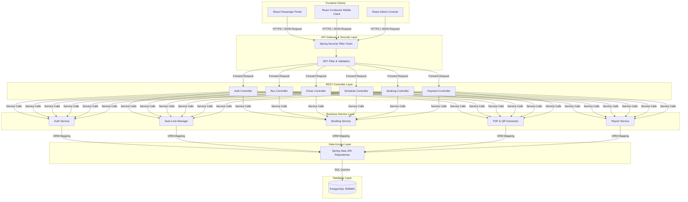

# Software Requirements Specification (SRS)
## SmartGo – Smart Bus Reservation & Management System

---

### 1. Introduction
The SmartGo Smart Bus Reservation & Management System is an enterprise-grade, web-based software application designed to automate and optimize the end-to-end transport booking, fleet management, and ticket verification operations for a single private bus transport company. Rather than serving as an open aggregator, marketplace, or multi-tenant system, SmartGo functions as a dedicated proprietary portal. 

Modern commuters demand digital-first services that let them view seat availability, secure specific allocations, and make online transactions. On the operations side, transport operators require automated tools to deploy vehicles, sequence route stops, schedule crews, and monitor financials. SmartGo bridges these needs by providing a unified portal. This document serves as the formal specification baseline for developing, testing, and deploying the SmartGo platform.

---

### 2. Purpose
This document defines the complete functional and non-functional requirements for the SmartGo system. It serves as the primary reference for software architects, database administrators, developers, QA engineers, and system operations specialists during implementation. It establishes a contract of delivery and outlines the architectural policies, business rules, and security baselines required to construct the platform.

---

### 3. Project Scope
SmartGo is structured around three primary web clients interacting with a centralized Java-based Spring Boot REST API backend:

*   **Passenger Web Portal**: A responsive web portal providing seat maps, payment checkouts, profile managers, booking histories, and PDF ticket receipts.
*   **Conductor Mobile Client**: A lightweight, mobile-responsive web portal designed for on-road validation of tickets using built-in web-camera QR scanners.
*   **Admin Dashboard Panel**: A management console enabling operational control over buses, routes, schedules, drivers, passenger accounts, and financial reports.

#### Out-of-Scope Items
*   **Multi-tenant support**: No support for third-party bus companies, franchise branding, or independent operator accounts.
*   **Native App Development**: Native Android (Kotlin/Java) or iOS (Swift) mobile apps are not built. Mobile-optimized responsive web interfaces are used instead.
*   **Payment Settlements**: Real money processing via credit cards, bank API integrations, or digital wallets. All transactions are processed using simulated payment gateways.

---

### 4. Business Problem
Historically, private bus companies operated using manual, paper-based workflows. These workflows result in several core issues:

1.  **Double Booking**: Without real-time, centralized seat state inventory management, booking operators frequently allocate the same physical seat coordinates to multiple passengers, leading to customer friction and operational delays.
2.  **Revenue Leakage**: Paper ticket registers and manual fare collection methods make it difficult to audit daily cash receipts, leading to missing funds and auditing challenges.
3.  **Inefficient Fleet & Staff Scheduling**: Coordinating bus locations with driver assignments is often handled on physical logbooks. This results in driver scheduling conflicts, underutilized vehicles, and missed schedules.
4.  **Slow Boarding Procedures**: Ticket verification at boarding relies on paper passenger lists. This slows boarding times and can lead to validation errors, especially during peak travel hours.
5.  **Lack of Operational Analytics**: Management has no real-time way to track route profitability, bus occupancy rates, or customer satisfaction trends.

---

### 5. Objectives
SmartGo is designed to achieve the following operational metrics:

*   **Eliminate Double Booking**: Maintain 100% database transaction safety with zero concurrent seat assignment conflicts.
*   **Decrease Boarding Times**: Enable conductors to scan and verify digital tickets in under 2 seconds.
*   **Optimize Fleet Scheduling**: Provide admins with a collision-free dashboard for assigning drivers and buses to route schedules.
*   **Enhance Booking Convenience**: Allow passengers to search, select, lock seats, and complete checkouts in under 3 minutes.
*   **Data-Driven Dashboards**: Deliver financial and operational summaries (load factors, top routes, revenue metrics) instantly.

---

### 6. Stakeholders

| Stakeholder Name | Type | Description / Role in the Project |
| :--- | :--- | :--- |
| **Passengers** | Primary User | Customers booking trips, paying for seats, downloading QR tickets, and submitting feedback. |
| **Conductors** | Primary User | On-board transit staff scanning ticket QR codes and registering passenger boarding status. |
| **Administrators** | Primary User | System managers controlling fleet configuration, driver manifests, schedules, and auditing reports. |
| **Transport Managers** | Indirect User | Company owners monitoring revenue dashboards, route metrics, and capacity utilization. |
| **QA / Dev Teams** | External | Engineering personnel building, verifying, and maintaining the SmartGo platform codebase. |

---

### 7. Definitions & Acronyms

*   **SRS**: Software Requirements Specification
*   **JWT**: JSON Web Token. A compact, URL-safe means of representing claims to be transferred between two parties.
*   **RBAC**: Role-Based Access Control. Restricting system access to authorized users based on their role (Admin, Conductor, Passenger).
*   **JPA**: Jakarta Persistence API. A Java specification for accessing, managing, and persisting data between Java objects and relational databases.
*   **Pessimistic Lock**: A database concurrency locking mechanism that prevents other transactions from modifying a row until the lock is released.
*   **DTO**: Data Transfer Object. An object that carries data between processes to reduce the number of method calls.
*   **OTP**: One-Time Password.
*   **UUID**: Universally Unique Identifier. A 128-bit value used to uniquely identify database records.

---

### 8. Assumptions
1.  All user roles (Passengers, Admins, Conductors) have access to internet-connected devices (smartphones, tablets, laptops).
2.  The server hosting the backend is configured in UTC time, and clients handle timezone translations locally.
3.  Conductor devices have functional cameras capable of capturing high-resolution video streams in varying lighting conditions to scan QR codes.

---

### 9. Constraints
1.  **Single-Tenant Constraint**: The database schema must handle data for only one bus operator. Multi-tenant database separation or tenant filtering is not built.
2.  **No Native Mobile Features**: Mobile scanning must run inside standard mobile web browsers (e.g. Chrome, Safari) using the WebRTC API, without relying on native Android/iOS camera wrappers.
3.  **Strict Technology Stack**: The backend must use Java 21, Spring Boot 3, and PostgreSQL, while the frontend must use React, Vite, and Tailwind CSS.
4.  **No Direct Financial Integration**: Compliance audits prevent integration with live bank processing systems. Simulated payment processing workflows must be used.

---

### 10. System Overview
SmartGo is organized as a layered enterprise application.



---

### 11. Functional Requirements

#### 11.1 Authentication & User Management (AUTH)

| Req ID | Module | Input | Processing | Output | Validation / Business Rules |
| :--- | :--- | :--- | :--- | :--- | :--- |
| **FR-AUTH-01** | Registration | Email, Full Name, Password, Phone Number. | 1. Hash password with BCrypt.<br>2. Save user record to DB.<br>3. Send confirmation email. | Passenger profile created. | Email must be unique, password minimum 8 chars with 1 symbol, 1 uppercase. |
| **FR-AUTH-02** | Login | Email, Password. | 1. Compare credentials with DB.<br>2. Generate JWT containing claims/roles.<br>3. Return authentication response. | Stateless JWT access token. | Limit failed logins to 5 attempts per 15 minutes before locking account. |
| **FR-AUTH-03** | Profile Update | Full Name, Phone Number. | Update user record in database. | Updated profile details. | Phone number must be unique and match country format validation. |
| **FR-AUTH-04** | User Management | User ID, target Role. | Admin updates roles (`ROLE_CONDUCTOR`, `ROLE_ADMIN`, `ROLE_PASSENGER`). | User role updated in DB. | Only users with `ROLE_ADMIN` can change role assignments. |

#### 11.2 Fleet, Driver & Route Management (FLEET)

| Req ID | Module | Input | Processing | Output | Validation / Business Rules |
| :--- | :--- | :--- | :--- | :--- | :--- |
| **FR-BUS-01** | Bus Creation | Reg Number, Vehicle Model, Capacity, Layout Type. | Create bus entity and auto-generate seat entities in DB. | Bus registered with static seats. | Registration plate must be unique. Capacity must match layout layout template. |
| **FR-BUS-02** | Bus Status | Bus ID, status code. | Update bus status (`ACTIVE`, `MAINTENANCE`, `INACTIVE`). | Status changed in database. | Deactivating a bus raises a warning if active scheduled trips are affected. |
| **FR-DRV-01** | Driver Profile | License Number, Full Name, Phone, Status. | Register driver details in database. | Driver profile created in DB. | License number must be unique and license validation dates checked. |
| **FR-DRV-02** | Driver Status | Driver ID, status code. | Update driver status (`ACTIVE`, `ON_LEAVE`, `SUSPENDED`). | Status changed in database. | Disallowing leave if driver is assigned to a trip on that date. |
| **FR-RTE-01** | Route Definition | Start/End Cities, Stop Sequenced IDs, distances. | Save route definition and stops sequence in DB. | Route ID with sequenced stops. | Sequences must start at 1, increase sequentially, distance must be > 0. |

#### 11.3 Schedule & Trip Management (SCH)

| Req ID | Module | Input | Processing | Output | Validation / Business Rules |
| :--- | :--- | :--- | :--- | :--- | :--- |
| **FR-SCH-01** | Create Schedule | Route ID, Bus ID, Driver ID, recurrence rule, base price. | Create trip schedule configuration template in DB. | Schedule configuration template. | Ensure bus and driver do not have scheduling conflicts during active window. |
| **FR-SCH-02** | Trip Generator | Trigger (Cron or Manual). | Generate individual `Trip` and `TripSeat` instances for the next 30 days. | Active trips and seat records. | Trips are generated automatically based on active schedules. |
| **FR-SCH-03** | Search Trips | Source Stop, Dest Stop, Departure Date. | Query DB for trips containing stops on the specified date. | Match trip list showing fares/seats. | Departure date must be equal to or greater than today's date. |

#### 11.4 Booking, Payment & Ticketing (BOOK)

| Req ID | Module | Input | Processing | Output | Validation / Business Rules |
| :--- | :--- | :--- | :--- | :--- | :--- |
| **FR-BOOK-01** | Select Seats | Trip ID, Seat ID list. | Check availability. Place temporary locks on `trip_seats` for 10 minutes. | Seats marked `LOCKED` with expiration. | Locked seats are automatically released if booking is not completed. |
| **FR-BOOK-02** | Create Booking | Trip ID, locked seat IDs, passenger details. | Generate `PENDING` booking record with amount calculation. | Booking reference (e.g. SG-123-ABC). | Limit booking to a maximum of 6 seats per transaction. |
| **FR-PAY-01** | Simulate Payment | Booking ID, Card details. | Process charge via simulated checkout. Update booking to `CONFIRMED`. | Transaction ID. | Failed checkout frees seats and updates booking status to `FAILED`. |
| **FR-TICK-01** | Issue Ticket | Confirmed Booking ID. | Generate PDF boarding passes, embed encrypted QR code hash. | PDF Ticket & QR code. | QR payload contains encrypted ticket ID, trip details, and signature. |
| **FR-TICK-02** | Scan QR | Scanned QR code payload. | Decrypt QR code payload, verify ticket status, update state to `BOARDED`. | Success/Failure status message. | Ticket must be for today's trip, have a status of `CONFIRMED`, and not be already scanned. |

#### 11.5 Feedback, Dashboard & Reports (REP)

| Req ID | Module | Input | Processing | Output | Validation / Business Rules |
| :--- | :--- | :--- | :--- | :--- | :--- |
| **FR-FEED-01** | Submit Review | Trip ID, rating (1-5), comment. | Save rating and optional comments to DB. | Review saved. | Only users with a `BOARDED` status for that trip can submit reviews. |
| **FR-REP-01** | Admin Reports | Date Range, Filter Type. | Aggregate bookings, revenue, load factors from database. | Graphs, tables. | Only accessible to users with `ROLE_ADMIN`. |

---

### 12. Non-Functional Requirements

#### 12.1 Security Requirements
*   **Data Encryption**: Hashing of passenger and administrative passwords using the BCrypt algorithm with a cost factor of 12.
*   **Network Security**: All communication channels must enforce TLS 1.3 (HTTPS).
*   **Authentication & Authorization**: Stateless JWT verification on every secure API request. Unauthorized endpoints must return a HTTP `401` or `403` status.
*   **CORS Configuration**: The backend REST API must block requests from domains outside the verified React client origin.

#### 12.2 Performance & Scalability
*   **Search Response Time**: Trip searches by origin/destination must execute in under 400ms under normal load.
*   **Seat Locking Speed**: Concurrent seat validation and locking database transactions must resolve in under 150ms.
*   **System Capacity**: The application must support up to 50 concurrent transactions per second without database deadlock exceptions.

#### 12.3 Reliability & Transactional Integrity
*   **Database ACID Compliance**: Booking creation and payment checkouts must run inside isolated transactional blocks (using `@Transactional`). Any API failure must trigger a complete database rollback.
*   **High Availability**: The stateless design of the REST API must support horizontal scaling behind a load balancer.

#### 12.4 Usability
*   **Responsive Layout**: The Passenger and Admin portals must use responsive styling to adapt to desktop and mobile viewports.
*   **Conductor Portal Efficiency**: The QR scanner camera interface must load and initialize in under 2 seconds on mobile browsers.

---

### 13. Business Rules

#### BR-01: Seat Locking Expiration
When a passenger selects seats, they are placed in a `LOCKED` state. The lock is managed by a database timestamp (`lock_expires_at`). The lock duration is exactly 10 minutes. A background scheduler runs every 60 seconds to release expired locks:
$$\text{Current Time} > \text{lock\_expires\_at} \implies \text{status} \to \text{AVAILABLE}$$

#### BR-02: Cancellation & Refund Calculations
Passengers can cancel confirmed bookings under the following refund schedule:

```text
Cancellation Time (Hours before departure)
      │
      ├─► > 24 hours ────────► 100% Refund (Booking Cancelled, Seats Available)
      │
      ├─► 12 - 24 hours ─────► 50% Refund (Booking Cancelled, Seats Available)
      │
      └─► < 12 hours ────────► 0% Refund (Non-refundable booking status)
```

#### BR-03: Double Booking Prevention
Seat reservations must use database row locks (`SELECT ... FOR UPDATE`) at the transaction level. This ensures that concurrent requests for the same seat ID are queued sequentially, preventing double bookings.

#### BR-04: Driver-Bus Allocation Limits
To prevent scheduling conflicts, a physical bus or driver cannot be assigned to overlapping trips:
$$\text{Trip}_A \cap \text{Trip}_B \neq \emptyset \implies \text{Bus}_A \neq \text{Bus}_B \quad \text{and} \quad \text{Driver}_A \neq \text{Driver}_B$$

#### BR-05: Conductor Scan Validation
A ticket QR code can only be scanned once. If scanned again, the system must block check-in, set the status to `ALERT`, and display: `"Ticket Already Scanned - Possible Duplicate Entry"`.

---

### 14. User Roles & Permissions Matrix

The system enforces Role-Based Access Control (RBAC). The following matrix defines endpoint permissions across system roles:

| Module / Action | Guest (Unauth) | Passenger | Conductor | Administrator |
| :--- | :---: | :---: | :---: | :---: |
| **Register Account** | ✔ | ✘ | ✘ | ✘ |
| **Search Trips** | ✔ | ✔ | ✔ | ✔ |
| **Book Tickets** | ✘ | ✔ | ✘ | ✘ |
| **Cancel Ticket** | ✘ | ✔ | ✘ | ✔ |
| **Submit Feedback** | ✘ | ✔ | ✘ | ✘ |
| **View Assigned Trips** | ✘ | ✘ | ✔ | ✔ |
| **Scan QR Tickets** | ✘ | ✘ | ✔ | ✔ |
| **Manage Fleet/Drivers** | ✘ | ✘ | ✘ | ✔ |
| **Manage Schedules** | ✘ | ✘ | ✘ | ✔ |
| **Access Reports / Financials** | ✘ | ✘ | ✘ | ✔ |

---

### 15. Risks & Mitigation Strategies

#### 15.1 High Concurrent Traffic During Flash Sales
*   **Risk**: Simultaneous checkout requests for popular holiday routes can cause database connection exhaustion or lock waits, leading to timeout errors.
*   **Mitigation**: Implement a lightweight memory caching layer (e.g. Redis) or optimize database indexing on the `trip_seats` table to handle rapid reads and status updates.

#### 15.2 Network Dropouts in Remote Terminals
*   **Risk**: Conductors may lose internet connectivity while scanning QR codes in remote areas, preventing ticket validation.
*   **Mitigation**: Design the conductor mobile client to cache the passenger manifest locally. Allow offline scanning against the cached manifest, syncing boarding records once connectivity is restored.

#### 15.3 JWT Secret Key Compromise
*   **Risk**: If the private key used to sign tokens is compromised, malicious actors can generate arbitrary authentication claims.
*   **Mitigation**: Store signing keys in environment variables outside the source code repository. Implement key rotation policies and verify token revocation.

---

### 16. Future Enhancements

1.  **GPS Fleet Location Integration**: Add IoT GPS tracking to display real-time bus locations on a map within the passenger portal.
2.  **AI Dynamic Fare Management**: Implement demand-based fare adjustments based on seat availability and search volume.
3.  **Third-Party Marketplace Portal**: Expand the platform's multi-tenant architecture to support third-party bus operators, commission tracking, and merchant accounts.
4.  **Loyalty Program**: Reward passenger travel history with points redeemable for discounts.

---

### 17. Acceptance Criteria

*   **AC-01 (Double Booking Protection)**: Under a simulated test run of 50 simultaneous booking requests for the same seat, exactly 1 request must succeed, and the remaining 49 must be rejected with validation errors.
*   **AC-02 (Conductor Scanning)**: The conductor portal must validate a QR ticket code and update its status to `BOARDED` in under 2 seconds.
*   **AC-03 (Seat Lock Release)**: Seats locked during checkout must automatically revert to `AVAILABLE` status within 60 seconds after the 10-minute lock timer expires.
*   **AC-04 (Dashboard Accuracy)**: The dashboard reports must reconcile total billing records with total transaction settlements to ensure financial reporting accuracy.
*   **AC-05 (Authentication Safety)**: An API call to secure resources (such as `/api/v1/admin/*`) without a valid bearer JWT must be rejected with a `403 Forbidden` response.
