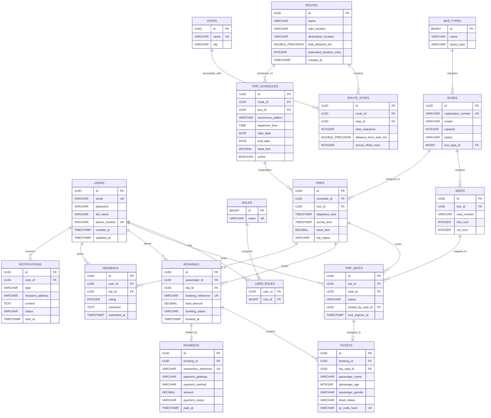

# Database Entity Relationship (ER) Diagram & Schema Specifications

This document outlines the logical and physical database schema design for the **SmartGo** Smart Bus Reservation & Management System. The database uses PostgreSQL.

---

## 1. Mermaid Entity Relationship Diagram

---

## 2. Entity Dictionary & Schema Specifications

### 2.1 Authentication & User Management

#### Table: `users`
Stores user profile information for passengers, conductors, and administrators.
*   `id` (UUID, Primary Key): Unique identifier (autogenerated).
*   `email` (VARCHAR(150), Unique, Not Null): User login email.
*   `password` (VARCHAR(255), Not Null): BCrypt hashed password representation.
*   `full_name` (VARCHAR(100), Not Null): Full name of the user.
*   `phone_number` (VARCHAR(20), Unique, Not Null): Primary contact number.
*   `created_at` (TIMESTAMP, Not Null): Account registration timestamp.
*   `updated_at` (TIMESTAMP, Not Null): Profile update timestamp.

#### Table: `roles`
Stores system permission roles.
*   `id` (BIGINT, Primary Key): Role identifier.
*   `name` (VARCHAR(50), Unique, Not Null): E.g., `ROLE_PASSENGER`, `ROLE_ADMIN`, `ROLE_CONDUCTOR`.

#### Table: `user_roles`
Join table mapping users to roles (Many-to-Many).
*   `user_id` (UUID, FK, Not Null): References `users(id)` (On Delete Cascade).
*   `role_id` (BIGINT, FK, Not Null): References `roles(id)` (On Delete Cascade).

---

### 2.2 Fleet & Seat Inventory

#### Table: `bus_types`
Classifies seat configuration maps and amenities.
*   `id` (BIGINT, Primary Key): Unique identifier.
*   `name` (VARCHAR(50), Not Null): E.g., "Luxury AC Sleeper", "Standard Non-AC Seater".
*   `layout_type` (VARCHAR(20), Not Null): Visual layout template key, e.g., `SEATER_2X2`, `SLEEPER_1X2`.

#### Table: `buses`
Represents physical vehicles in the transport fleet.
*   `id` (UUID, Primary Key): Unique vehicle identifier.
*   `registration_number` (VARCHAR(30), Unique, Not Null): State registration number plate.
*   `model` (VARCHAR(100), Not Null): Manufacturer model description.
*   `capacity` (INTEGER, Not Null): Total quantity of seats.
*   `status` (VARCHAR(30), Not Null): E.g., `ACTIVE`, `MAINTENANCE`, `INACTIVE`.
*   `bus_type_id` (BIGINT, FK, Not Null): References `bus_types(id)`.

#### Table: `seats`
Declares the static physical seat layout map for a bus.
*   `id` (UUID, Primary Key): Unique seat identifier.
*   `bus_id` (UUID, FK, Not Null): References `buses(id)` (On Delete Cascade).
*   `seat_number` (VARCHAR(10), Not Null): E.g., "A1", "A2", "B1".
*   `row_num` (INTEGER, Not Null): Horizontal positioning coordinates.
*   `col_num` (INTEGER, Not Null): Vertical positioning coordinates.

---

### 2.3 Routes & Schedules

#### Table: `routes`
Defines operational travel routes between terminal locations.
*   `id` (UUID, Primary Key): Unique route identifier.
*   `name` (VARCHAR(150), Not Null): Descriptive title, e.g., "New York Express - Route 10A".
*   `start_location` (VARCHAR(100), Not Null): Departure terminal city name.
*   `destination_location` (VARCHAR(100), Not Null): Arrival terminal city name.
*   `total_distance_km` (DOUBLE_PRECISION, Not Null): Direct path distance in kilometers.
*   `estimated_duration_mins` (INTEGER, Not Null): Scheduled journey duration.
*   `created_at` (TIMESTAMP, Not Null): Timestamp of route creation.

#### Table: `stops`
Stores physical stops or bus stands.
*   `id` (UUID, Primary Key): Unique stop identifier.
*   `name` (VARCHAR(150), Unique, Not Null): Stop description.
*   `city` (VARCHAR(100), Not Null): Associated city.

#### Table: `route_stops`
Maintains sequence mappings of intermediate stops on routes (Many-to-Many association).
*   `id` (UUID, Primary Key): Sequence identifier.
*   `route_id` (UUID, FK, Not Null): References `routes(id)` (On Delete Cascade).
*   `stop_id` (UUID, FK, Not Null): References `stops(id)`.
*   `stop_sequence` (INTEGER, Not Null): Ordered index representing the stop order (e.g. 1, 2, 3).
*   `distance_from_start_km` (DOUBLE_PRECISION, Not Null): Cumulative distance from the route start stop.
*   `arrival_offset_mins` (INTEGER, Not Null): Cumulative travel time offset from departure.

#### Table: `trip_schedules`
Defines recurring configuration matrices used to instantiate actual trips.
*   `id` (UUID, Primary Key): Unique schedule configuration identifier.
*   `route_id` (UUID, FK, Not Null): References `routes(id)`.
*   `bus_id` (UUID, FK, Not Null): References `buses(id)`.
*   `recurrence_pattern` (VARCHAR(50), Not Null): E.g., `DAILY`, `WEEKLY`, `MON_WED_FRI`.
*   `departure_time` (TIME, Not Null): Daily scheduled time of departure.
*   `start_date` (DATE, Not Null): Active schedule start window.
*   `end_date` (DATE, Not Null): Active schedule decommissioning date.
*   `base_fare` (DECIMAL(10,2), Not Null): Initial pricing baseline for bookings.
*   `active` (BOOLEAN, Not Null): Indicator to suspend or activate automatic generator routines.

---

### 2.4 Trips & Dynamic Inventory

#### Table: `trips`
Represents an active, specific departure instance of a route.
*   `id` (UUID, Primary Key): Unique trip execution identifier.
*   `schedule_id` (UUID, FK, Nullable): Reference back to configuration template.
*   `bus_id` (UUID, FK, Not Null): References `buses(id)`.
*   `departure_time` (TIMESTAMP, Not Null): Scheduled departure timestamp.
*   `arrival_time` (TIMESTAMP, Not Null): Scheduled arrival timestamp.
*   `base_fare` (DECIMAL(10,2), Not Null): Active trip-specific pricing.
*   `trip_status` (VARCHAR(30), Not Null): E.g., `SCHEDULED`, `BOARDING`, `DEPARTED`, `COMPLETED`, `CANCELLED`.

#### Table: `trip_seats`
Tracks seat states for every distinct trip instance.
*   `id` (UUID, Primary Key): Unique trip seat state identifier.
*   `trip_id` (UUID, FK, Not Null): References `trips(id)` (On Delete Cascade).
*   `seat_id` (UUID, FK, Not Null): References `seats(id)`.
*   `status` (VARCHAR(30), Not Null): E.g., `AVAILABLE`, `LOCKED`, `BOOKED`.
*   `locked_by_user_id` (UUID, FK, Nullable): References `users(id)` holding temporary booking.
*   `lock_expires_at` (TIMESTAMP, Nullable): Timestamp marking auto-release deadline.

---

### 2.5 Bookings, Tickets & Transactions

#### Table: `bookings`
Handles the master reservation record.
*   `id` (UUID, Primary Key): Unique booking identifier.
*   `passenger_id` (UUID, FK, Not Null): References `users(id)`.
*   `trip_id` (UUID, FK, Not Null): References `trips(id)`.
*   `booking_reference` (VARCHAR(50), Unique, Not Null): Short alphanumeric billing reference code (e.g. `SG-49204-NYC`).
*   `total_amount` (DECIMAL(10,2), Not Null): Calculated payment total.
*   `booking_status` (VARCHAR(30), Not Null): E.g., `PENDING`, `CONFIRMED`, `FAILED`, `CANCELLED`.
*   `booked_at` (TIMESTAMP, Not Null): Timestamp of the initial booking lock step.

#### Table: `tickets`
Represents boarding privileges for a single passenger seat on a trip.
*   `id` (UUID, Primary Key): Unique ticket code.
*   `booking_id` (UUID, FK, Not Null): References `bookings(id)` (On Delete Cascade).
*   `trip_seat_id` (UUID, FK, Not Null): References `trip_seats(id)`.
*   `passenger_name` (VARCHAR(100), Not Null): Passenger name.
*   `passenger_age` (INTEGER, Not Null): Passenger age.
*   `passenger_gender` (VARCHAR(20), Not Null): Passenger gender.
*   `ticket_status` (VARCHAR(30), Not Null): E.g., `CONFIRMED`, `BOARDED`, `CANCELLED`.
*   `qr_code_hash` (VARCHAR(255), Unique, Not Null): Encrypted JWT verification token payload inside QR code representation.

#### Table: `payments`
Stores checkout audit records.
*   `id` (UUID, Primary Key): Transaction tracking identifier.
*   `booking_id` (UUID, FK, Not Null): References `bookings(id)`.
*   `transaction_reference` (VARCHAR(150), Unique, Not Null): External gateway reference ID.
*   `payment_gateway` (VARCHAR(50), Not Null): E.g., `MOCK_STRIPE`, `MOCK_PAYPAL`.
*   `payment_method` (VARCHAR(50), Not Null): E.g., `CREDIT_CARD`, `DEBIT_CARD`.
*   `amount` (DECIMAL(10,2), Not Null): Exact settlement value.
*   `payment_status` (VARCHAR(30), Not Null): E.g., `SUCCESS`, `PENDING`, `FAILED`.
*   `paid_at` (TIMESTAMP, Not Null): Timestamp confirming settlement.

---

### 2.6 User Interactions & Audit

#### Table: `feedback`
Captures passenger reviews for completed trips.
*   `id` (UUID, Primary Key): Feedback identifier.
*   `user_id` (UUID, FK, Not Null): References `users(id)`.
*   `trip_id` (UUID, FK, Not Null): References `trips(id)`.
*   `rating` (INTEGER, Not Null): Numeric rating between 1 and 5.
*   `comment` (TEXT, Nullable): Qualitative passenger comments.
*   `submitted_at` (TIMESTAMP, Not Null): Timestamp of submission.

#### Table: `notifications`
Audit trail of SMS/Email triggers sent to users.
*   `id` (UUID, Primary Key): Message tracking identifier.
*   `user_id` (UUID, FK, Not Null): References `users(id)` (On Delete Cascade).
*   `type` (VARCHAR(30), Not Null): E.g., `EMAIL`, `SMS`.
*   `recipient_address` (VARCHAR(150), Not Null): Target destination phone or email address.
*   `content` (TEXT, Not Null): Message payload.
*   `status` (VARCHAR(30), Not Null): E.g., `PENDING`, `SENT`, `FAILED`.
*   `sent_at` (TIMESTAMP, Not Null): Despatch time.
