# Class Diagram & Object-Oriented Design

This document details the object-oriented design and class architecture of the **SmartGo** backend system. The system is designed using Java 21, Spring Boot 3, and Spring Data JPA. It conforms to a layered architecture: Controllers handle web REST request mapping, Services encapsulate business domain logic, and Repositories handle database persistence.

---

## 1. Mermaid Class Diagram

This diagram visualizes the structural layers and dependency relationships for core modules in the system.

```mermaid
classDiagram
    %% Core Framework / Cross-Cutting Layers
    class JwtFilter {
        +doFilterInternal(request, response, filterChain) void
    }
    class JwtService {
        -secretKey String
        -expirationMs long
        +extractUsername(token) String
        +generateToken(userDetails) String
        +isTokenValid(token, userDetails) boolean
    }
    class GlobalExceptionHandler {
        +handleResourceNotFound(ex) ResponseEntity
        +handleValidationExceptions(ex) ResponseEntity
        +handlePaymentException(ex) ResponseEntity
    }

    %% Authentication Module
    class AuthController {
        -authService AuthService
        +register(request) ResponseEntity~UserDto~
        +login(request) ResponseEntity~JwtResponseDto~
    }
    class AuthService {
        -userRepository UserRepository
        -passwordEncoder PasswordEncoder
        -jwtService JwtService
        +registerPassenger(dto) UserDto
        +authenticateUser(dto) JwtResponseDto
    }

    %% User Module
    class UserController {
        -userService UserService
        +getCurrentUser() ResponseEntity~UserDto~
        +updateProfile(dto) ResponseEntity~UserDto~
    }
    class UserService {
        -userRepository UserRepository
        +getUserById(id) User
        +updateUserProfile(id, dto) User
    }
    class UserRepository {
        <<interface>>
        +findByEmail(email) Optional~User~
        +existsByEmail(email) boolean
    }
    
    %% Bus Module
    class BusController {
        -busService BusService
        +createBus(dto) ResponseEntity~BusDto~
        +getBus(id) ResponseEntity~BusDto~
    }
    class BusService {
        -busRepository BusRepository
        +saveBus(dto) BusDto
        +getBusDetails(id) BusDto
    }
    class BusRepository {
        <<interface>>
        +findByRegistrationNumber(regNum) Optional~Bus~
    }

    %% Booking Module
    class BookingController {
        -bookingService BookingService
        +createBooking(request) ResponseEntity~BookingDto~
        +confirmBooking(id, payDto) ResponseEntity~BookingDto~
    }
    class BookingService {
        -bookingRepository BookingRepository
        -tripSeatRepository TripSeatRepository
        -paymentService PaymentService
        -ticketService TicketService
        +initiateBooking(userId, tripId, seatIds) BookingDto
        +completeCheckout(bookingId, paymentDetails) BookingDto
    }
    class BookingRepository {
        <<interface>>
        +findByBookingReference(ref) Optional~Booking~
        +findAllByPassengerId(passengerId) List~Booking~
    }

    %% Seat Module
    class TripSeatRepository {
        <<interface>>
        +findLockedSeatsByTrip(tripId) List~TripSeat~
        +findSeatsForUpdate(ids) List~TripSeat~
    }

    %% Ticket / QR Module
    class TicketService {
        -ticketRepository TicketRepository
        -qrService QrService
        -pdfService PdfService
        +issueTickets(booking) List~Ticket~
        +verifyQrTicket(qrHash) TicketVerificationResponseDto
    }
    class QrService {
        +generateQrPayload(ticket) String
        +verifyQrPayload(qrHash) String
    }
    class PdfService {
        +generateTicketPdf(ticket) byte[]
    }
    class TicketRepository {
        <<interface>>
        +findByQrCodeHash(qrHash) Optional~Ticket~
    }

    %% Dependencies & Injections
    AuthController --> AuthService : uses
    AuthService --> UserRepository : uses
    AuthService --> JwtService : uses
    UserController --> UserService : uses
    UserService --> UserRepository : uses
    JwtFilter --> JwtService : uses
    BusController --> BusService : uses
    BusService --> BusRepository : uses
    BookingController --> BookingService : uses
    BookingService --> BookingRepository : uses
    BookingService --> TripSeatRepository : uses
    BookingService --> TicketService : uses
    TicketService --> TicketRepository : uses
    TicketService --> QrService : uses
    TicketService --> PdfService : uses
```

---

## 2. Layer & Class Specifications

### 2.1 Cross-Cutting & Infrastructure Layer

#### `JwtFilter` (Extends `OncePerRequestFilter`)
*   **Responsibility**: Intercepts HTTP requests, extracts the JWT header, parses the username, and establishes the Spring Security authentication context if valid.

#### `JwtService`
*   **Responsibility**: Handles JWT generation, verification, expiration claims extraction, and token signature signing using HMAC-SHA256 algorithms.

#### `GlobalExceptionHandler`
*   **Responsibility**: Annotates with `@ControllerAdvice` to intercept runtime exceptions across all endpoints and return standardized error objects (RFC 7807 problem details) with HTTP status codes.

---

### 2.2 Authentication & User Module

#### `AuthController`
*   **Responsibility**: Exposes public REST endpoints for user authentication and onboarding.
*   **Methods**:
    *   `register(RegisterRequestDto)`: Registers a passenger account.
    *   `login(LoginRequestDto)`: Authenticates credentials and issues a JWT.

#### `AuthService`
*   **Responsibility**: Orchestrates registration safety checks, encodes passwords using BCrypt, generates JWT claims, and registers roles.

#### `UserRepository` (Extends `JpaRepository<User, UUID>`)
*   **Responsibility**: Database abstraction interface executing CRUD operations on the `users` table.

---

### 2.3 Bus & Fleet Module

#### `BusService`
*   **Responsibility**: Business validator for onboarding buses, updating status to maintenance, and synchronizing seat configurations according to dynamic layout types.

#### `BusRepository` (Extends `JpaRepository<Bus, UUID>`)
*   **Responsibility**: Coordinates custom query methods retrieving bus assets by their vehicle registration plates.

---

### 2.4 Booking & Seat Allocation Module

#### `BookingService`
*   **Responsibility**: Coordinates the critical path transactional steps of booking:
    1.  Verifies availability of selected seats for the trip.
    2.  Creates temporary concurrency locks on `trip_seats`.
    3.  Instantiates a `PENDING` booking.
    4.  Calls `PaymentService` to verify mock charge processing.
    5.  Converts temporary seat locks into confirmed reservations on success.
    6.  Triggers `TicketService` to issue QR boarding passes.

#### `TripSeatRepository` (Extends `JpaRepository<TripSeat, UUID>`)
*   **Responsibility**: Focuses on atomic seat status operations. Uses database-level locks (`SELECT FOR UPDATE`) to prevent race conditions during concurrent booking requests.

---

### 2.5 Digital Ticket & Verification Module

#### `TicketService`
*   **Responsibility**: Converts booking line-items into tickets, maps seat numbers, coordinates QR encryption, and formats PDF documents. Supports conductor check-in calls.

#### `QrService`
*   **Responsibility**: Formats verification payloads containing unique IDs, encrypted signatures, and expiration parameters, converting them into QR image assets.

#### `PdfService`
*   **Responsibility**: Compiles travel documents into printable PDF documents using templates containing ticket information and embedded QR codes.
