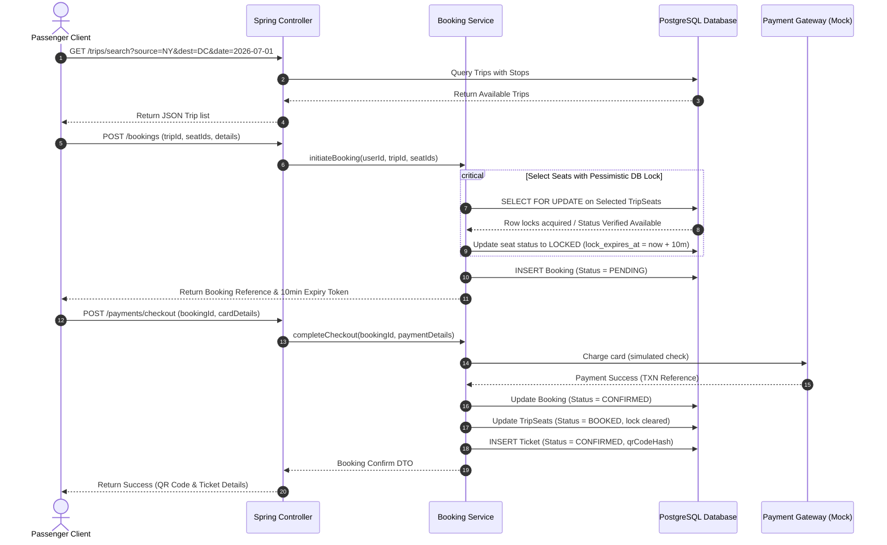
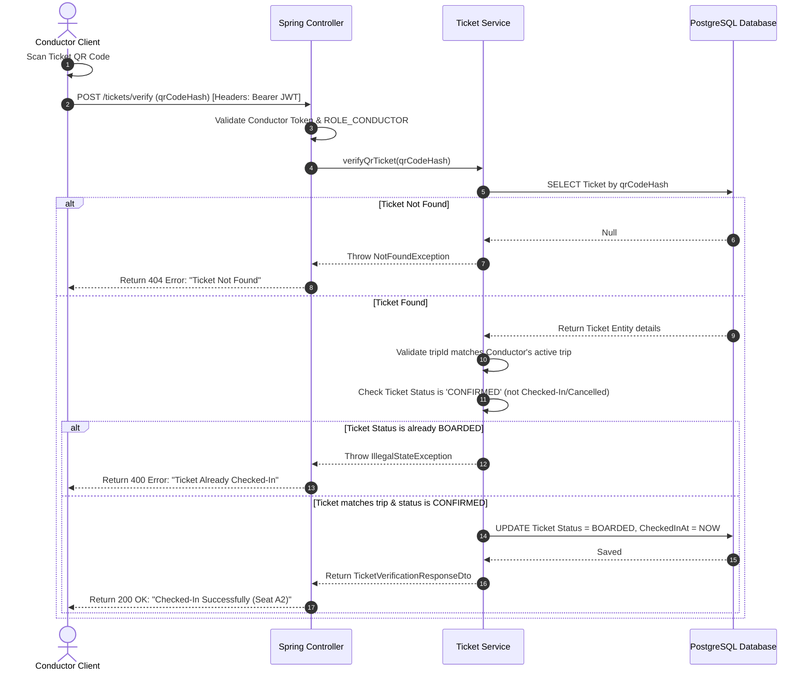

# Project Architecture & Request Lifecycle

This document describes the system architecture, security workflows, and data lifecycle for the **SmartGo** Smart Bus Reservation & Management System.

---

## 1. System Architecture

SmartGo implements a classic **Layered (n-tier) Architecture** combined with a stateless REST API model. 

```text
+-----------------------------------------------------------------+
|                       Presentation Layer                        |
|   (React / Vite Single Page Application on Tailwind CSS)        |
+------------------------------------+----------------------------+
                                     | HTTPS / JSON
                                     v
+-----------------------------------------------------------------+
|                       API Gateway / Filters                     |
|           (Spring Security, CORS Filters, JWT Validator)        |
+------------------------------------+----------------------------+
                                     |
                                     v
+-----------------------------------------------------------------+
|                       Controller Layer                          |
|         (Spring REST Controllers - @RestController)             |
+------------------------------------+----------------------------+
                                     | DTOs (Data Transfer Objects)
                                     v
+-----------------------------------------------------------------+
|                       Business Logic Layer                      |
|       (Spring Service Components - @Service, @Transactional)     |
+------------------------------------+----------------------------+
                                     | Entity Models
                                     v
+-----------------------------------------------------------------+
|                       Data Access Layer                         |
|     (Spring Data JPA Repositories - @Repository, Hibernate)     |
+------------------------------------+----------------------------+
                                     | SQL Queries
                                     v
+-----------------------------------------------------------------+
|                       Database Layer                            |
|                  (PostgreSQL Relational DB)                     |
+-----------------------------------------------------------------+
```

### 1.1 Architectural Layers

1.  **Presentation Layer**: A client-side Single Page Application (SPA) built using React. It communicates with the backend exclusively via asynchronous HTTP requests (`Axios`).
2.  **API Gateway & Security Filter**: Spring Security acts as the entry guardian, validating inbound JWT headers. Unauthenticated or unauthorized requests are rejected prior to reaching controller code.
3.  **Controller Layer**: Handles REST path routing, parses request payloads, and performs input validation (e.g., checks format constraints using Jakarta Bean Validation `@Valid`). It translates request payloads to DTOs.
4.  **Business Logic Layer**: Decoupled service interfaces carrying out domain-specific operations (e.g., executing transaction locks, calculating fares, coordinating PDF stream generation).
5.  **Data Access Layer**: Uses Spring Data JPA to abstract database interactions, enabling clean Hibernate ORM entity mappings and transactional database commits.
6.  **Database Layer**: PostgreSQL stores tables, indexes, constraints, and enforces schema integrity.

---

## 2. Request Lifecycle

The lifecycle of an API request to SmartGo transitions through the following pipeline:

```text
[Inbound HTTP Request]
        │
        ▼
 1. Security Filters ────────► [Validates JWT Token & Role Permissions]
        │ (Authorized)
        ▼
 2. DispatcherServlet ───────► [Spring MVC Request Router]
        │
        ▼
 3. Handler Interceptors ────► [Pre-handle Loggers, Rate Limiters]
        │
        ▼
 4. Controller Layer ────────► [Binds Request Parameters & Validates Body]
        │
        ▼
 5. Service Layer ───────────► [Executes Business Logic & Manages Transaction]
        │
        ▼
 6. Repository Layer ────────► [Executes JPA Queries / Database Locks]
        │
        ▼
 7. Database (PostgreSQL) ───► [Applies SQL & Releases Rows]
        │
        ▼
 8. Return Controller ───────► [Maps Entities to DTO Response]
        │
        ▼
 9. Interceptors / Filters ──► [Post-handle / Response Headers]
        │
        ▼
[Outbound JSON Response]
```

---

## 3. Core Sequence Diagrams

### 3.1 Ticket Booking Flow

The sequence of searching for a trip, locking a seat, paying, and generating the boarding pass:



### 3.2 Conductor QR Boarding Verification Flow

The sequence of verifying a passenger boarding code using a mobile conductor client:



---

## 4. Security Flow Details

SmartGo security is stateless, driven by JSON Web Tokens (JWT) integrated into the Spring Security ecosystem.

```text
[Client Request]
       │
       ▼
┌──────────────────────────────────────────────┐
│  JwtAuthenticationFilter                     │
│  - Reads "Authorization" Header              │
│  - Extracts Bearer token                     │
│  - Requests JwtService to parse & validate   │
└──────────────────────┬───────────────────────┘
                       │ Valid Signature & Date
                       ▼
┌──────────────────────────────────────────────┐
│  Spring Security Context                     │
│  - Loads User Details (Email, Roles)         │
│  - Populates UsernamePasswordAuthToken       │
│  - Inject token into SecurityContextHolder   │
└──────────────────────┬───────────────────────┘
                       │
                       ▼
┌──────────────────────────────────────────────┐
│  Role-Based Access Checks                    │
│  - Validates method security permissions     │
│  - E.g., @PreAuthorize("hasRole('ADMIN')")   │
└──────────────────────┬───────────────────────┘
                       │ Passed
                       ▼
               [Controller Method]
```

### 4.1 Security Rules & Controls

1.  **Password Storage**: Encrypted at time of write using BCrypt inside `AuthService`. The raw password is never logged or exposed in responses.
2.  **HTTPS Enforcement**: Production web configuration redirects all HTTP traffic to HTTPS via a secure transport policy (HSTS).
3.  **CORS Policy**: Restricts origin requests strictly to the whitelisted domain name of the React frontend application.
